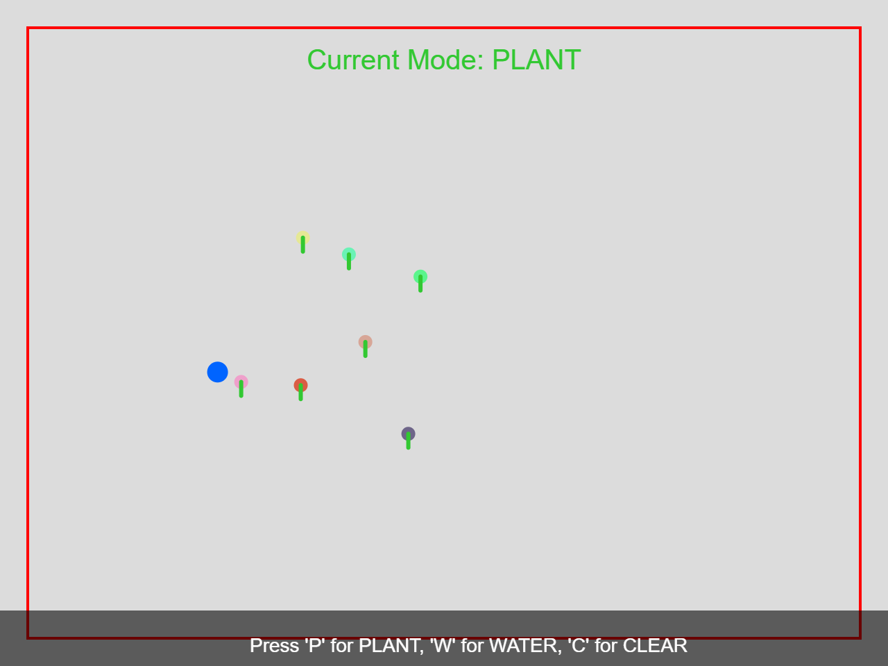
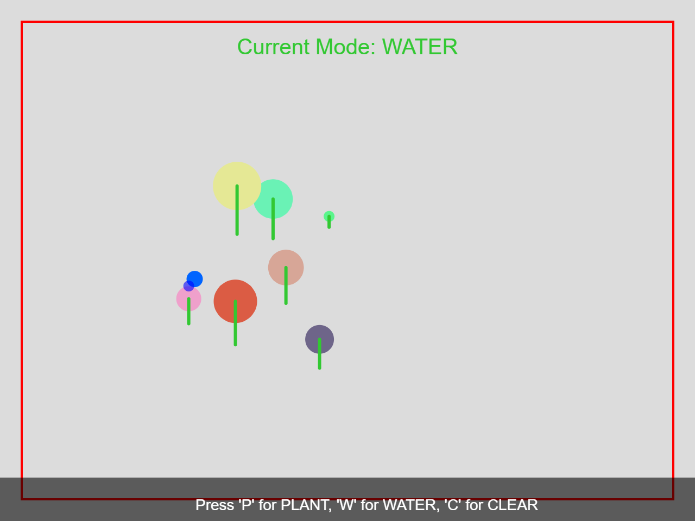

# HW09A

# **Neon Mondrian**

## **Overview**
This project is a modern remix of Piet Mondrian’s iconic artwork using **p5.js**, allowing users to personalize the red, yellow, and blue regions interactively. By leveraging color pickers and sliders, users can adjust colors, transparency, and save their creations.

---

## **Features**
- **Color Replacement**:
  - Replace red, yellow, and blue regions of the artwork with user-selected colors using interactive color pickers.
- **Transparency Adjustment**:
  - Adjust the transparency of non-primary regions using a slider to reveal the randomized background color.
- **Reset Button**:
  - Restore the original Mondrian painting with a single click.
- **Save Artwork**:
  - Export your creation as a PNG file for sharing or printing.

---

## **How to Use**
1. **Load the Project**:
   - Open the `index.html` file in a browser or access the live version hosted on GitHub Pages.
2. **Customize Colors**:
   - Use the red, yellow, and blue color pickers to modify specific regions of the painting.
3. **Adjust Transparency**:
   - Use the transparency slider to blend the non-primary areas with a randomized background.
4. **Reset Artwork**:
   - Click the "Reset" button to restore the original Mondrian painting.
5. **Save Your Work**:
   - Click "Save Artwork" to download the current artwork as a PNG file.

---

## **User Interface**
- **Color Pickers**:
  - Replace red, yellow, and blue regions with user-defined colors.
- **Sliders**:
  - **Similarity Threshold**: Fine-tune the sensitivity of the color detection algorithm.
  - **Transparency**: Control the opacity of non-primary regions.
- **Buttons**:
  - **Reset**: Restores the painting to its original state.
  - **Save Artwork**: Downloads the current canvas as a PNG file.

---

# HW09B
# Interactive Hand-Tracked Digital Garden 

## Overview
The **Interactive Hand-Tracked Digital Garden** is a creative project that allows users to plant and water virtual plants using their hands, tracked via a webcam. The project uses **p5.js** for graphics and **ml5.js** for hand tracking, creating an immersive and interactive experience.

---

## Features
1. **Hand Tracking**:
   - Tracks the user's hand using the `ml5.handpose` model.
   - Detects the index finger to control planting and watering.
   - when s is pressed it saves the artwork

2. **Modes of Interaction**:
   - **Plant Mode** (`P`): Plant seeds by moving your hand to a position and clicking.
   - **Water Mode** (`W`): Water plants to help them grow by hovering your hand near them.
   - **Clear Mode** (`C`): Clear the entire garden and start fresh.

3. **Dynamic Garden**:
   - Plants grow when watered.
   - Visual indicators for planting and watering actions.

4. **Visual Feedback**:
   - A boundary rectangle to indicate the detectable area.
   - Mode displayed at the top with color-coded feedback:
     - Green for planting.
     - Blue for watering.
     - Red for clearing.

5. **Error Handling**:
   - Displays a warning if the hand moves out of the camera's detectable area.
   - Alerts the user if no hand is detected.

---

## How to Use
1. **Controls**: 
  It will also show you are in which mode in the top of the screen of the canva in centre and also it shows no hand detected when hands aren't detected
   - `P`: Enter **Plant Mode**. Click to plant seeds at the hand's position.
   - `W`: Enter **Water Mode**. Hover your hand near a plant to water it.
   - `C`: Clear the garden and start anew.
   - `S`: Saves the artwork

2. **Tips**:
   - Keep your hand within the boundary rectangle for optimal detection.
   - Ensure good lighting for accurate hand tracking.

---

## Requirements
- **Browser**: A modern browser like Chrome or Firefox.
- **Camera**: A functional webcam for hand tracking.
- **Libraries**:
  - [p5.js](https://cdnjs.cloudflare.com/ajax/libs/p5.js/1.4.0/p5.min.js)
  - [ml5.js](https://cdnjs.cloudflare.com/ajax/libs/ml5/0.12.2/ml5.min.js)

---

## Technical Details
### Core Logic
1. **Hand Tracking**:
   - The `ml5.handpose` model detects the position of the user's hand and identifies the index finger's coordinates.
   - Smoothing and movement threshold techniques reduce jitter and noise.

2. **Plant Growth**:
   - Plants are represented as objects with size and growth rate attributes.
   - Watering a plant increases its size, capped at a maximum value.

3. **Visual Indicators**:
   - Blue circle: Hand's smoothed position.
   - Boundary rectangle: Detectable area for hand tracking.

---

## Example Output

### Planting Mode

### Watering Mode

---

## Known Issues
1. **Hand Out of Bounds**:
   - The system cannot detect hands outside the camera's field of view.
   - Ensure your hand remains within the boundary.

2. **Low-Light Conditions**:
   - Poor lighting can reduce the accuracy of hand tracking.

---

